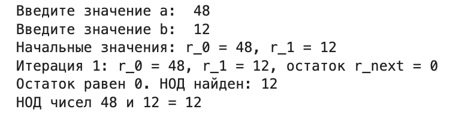

---
## Front matter
lang: ru-RU
title: Алгоритм Евклида
author: Надиа Эззакат
institute: Российский Университет Дружбы Народов
date: 24 октября, 2024, Москва, Россия
---

## Formatting
mainfont: PT Serif
romanfont: PT Serif
sansfont: PT Sans
monofont: PT Mono
toc: false
slide_level: 2
theme: metropolis
header-includes: 
 - \metroset{progressbar=frametitle,sectionpage=progressbar,numbering=fraction}
 - '\makeatletter'
 - '\beamer@ignorenonframefalse'
 - '\makeatother'
aspectratio: 43
section-titles: true

---

# Цели и задачи

## Цель лабораторной работы

Изучение алгоритма Евклида нахождения Наибольший общий делитель и его вариаций.

--- 

# Выполнение лабораторной работы

## Наибольший общий делитель

Наибольший общий делитель (НОД) – это наибольшее целое число, на которое два или более целых числа можно поделить без остатка. Например, НОД чисел 12 и 18 равен 6, потому что 6 является наибольшим числом, которое делит оба этих числа на целое.

---

## Алгоритм Евклида

  Вход. Целые числа $a, b; 0 < b < a$.
  Выход. $d =$ НОД$(a,b)$.

- шаг 1. Положить $r_0 = a$, $r_1 = b$, $i = 1$.
- шаг 2. Найти остаток $r_i+1$ от деления $r_i–1$ на $r_i$.
- шаг 3. Если $r_i+1 = 0$, то положить $d = r_i$. В противном случае положить $i = i+1$ и вернуться на шаг 2.
- шаг 4. Результат: $d$.

---

## Бинарный алгоритм Евклида

* Вход. Целые числа $a, b; 0 < b ≤ a$.
* Выход. $d =$ HOД$(a,b)$.

1. Положить $g = 1$.
2. Пока оба числа $a$ и $b$ четные, выполнять $a = a/2, b = b/2, g = 2g$ до получения хотя бы одного нечетного значения $a$ или $b$.
3. Положить $u = a, v = b$.
4. Пока $u \neq 0$, выполнять следующие действия.
	- Пока $u$ четное, полагать $u = u/2$.
	- Пока $v$ четное, полагать $v = v/2$.
	- При $u \geq v$ положить $u = u - v$. В противном случае положить $v = v – u$.
5. Положить $d = gv$.
6. Результат: $d$

---

## Расширенный алгоритм Евклида

* Вход. Целые числа $a, b; 0 < b ≤ a$.
* Выход: $d =$ НОД$(a, b)$; такие целые числа $x, y$, что $ax + by = d$.

1. Положить $r_0 = a, r_1 = b, x_0 = 1, x_1 = 0, y_0 = 0, y_1 = 1, i = 1$
2. Разделить с остатком $r_i–1$ на $r_i$ : $r_(i–1) = q_i*r_i + r_i + 1$
3. Если $r_(i+1) = 0$, то положить $d = r_i$, $x = x_i$, $y = y_i$. В противном случае положить $x_(i+1) = (x_(i–1) – q_i*x_i$, $y_(i+1) = y_(i–1) – q_i*y_i$, $i = i + 1$ и вернуться на шаг 2.
4. Результат: $d, x, y$.

---

## Пример работы алгоритма

---

# Выводы

## Результаты выполнения лабораторной работы

Изучилa алгоритм Евклида нахождения Наибольший общий делитель.