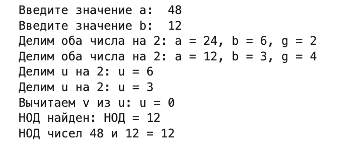
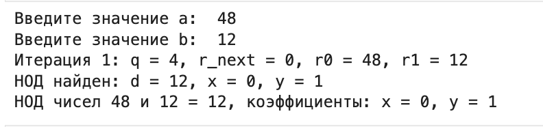
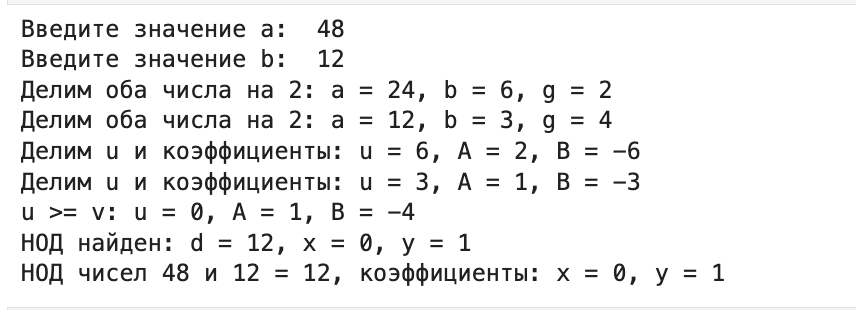

---
# Front matter
title: "Отчёт по лабораторной работе №4"
subtitle: "Алгоритм Евклида"
author: "Надиа Эззакат"

# Generic otions
lang: ru-RU
toc-title: "Содержание"

# Bibliography
bibliography: bib/cite.bib
csl: pandoc/csl/gost-r-7-0-5-2008-numeric.csl

# Pdf output format
toc: true # Table of contents
toc_depth: 2
lof: true # List of figures
fontsize: 12pt
linestretch: 1.5
papersize: a4
documentclass: scrreprt
## I18n
polyglossia-lang:
  name: russian
  options:
	- spelling=modern
	- babelshorthands=true
polyglossia-otherlangs:
  name: english
### Fonts
mainfont: PT Serif
romanfont: PT Serif
sansfont: PT Sans
monofont: PT Mono
mainfontoptions: Ligatures=TeX
romanfontoptions: Ligatures=TeX
sansfontoptions: Ligatures=TeX,Scale=MatchLowercase
monofontoptions: Scale=MatchLowercase,Scale=0.9
## Biblatex
biblatex: true
biblio-style: "gost-numeric"
biblatexoptions:
  - parentracker=true
  - backend=biber
  - hyperref=auto
  - language=auto
  - autolang=other*
  - citestyle=gost-numeric
## Misc options
indent: true
header-includes:
  - \linepenalty=10 # the penalty added to the badness of each line within a paragraph (no associated penalty node) Increasing the value makes tex try to have fewer lines in the paragraph.
  - \interlinepenalty=0 # value of the penalty (node) added after each line of a paragraph.
  - \hyphenpenalty=50 # the penalty for line breaking at an automatically inserted hyphen
  - \exhyphenpenalty=50 # the penalty for line breaking at an explicit hyphen
  - \binoppenalty=700 # the penalty for breaking a line at a binary operator
  - \relpenalty=500 # the penalty for breaking a line at a relation
  - \clubpenalty=150 # extra penalty for breaking after first line of a paragraph
  - \widowpenalty=150 # extra penalty for breaking before last line of a paragraph
  - \displaywidowpenalty=50 # extra penalty for breaking before last line before a display math
  - \brokenpenalty=100 # extra penalty for page breaking after a hyphenated line
  - \predisplaypenalty=10000 # penalty for breaking before a display
  - \postdisplaypenalty=0 # penalty for breaking after a display
  - \floatingpenalty = 20000 # penalty for splitting an insertion (can only be split footnote in standard LaTeX)
  - \raggedbottom # or \flushbottom
  - \usepackage{float} # keep figures where there are in the text
  - \floatplacement{figure}{H} # keep figures where there are in the text
---

# Цель работы

Изучение алгоритма Евклида нахождения Наибольший общий делитель и его вариаций.

# Теоретические сведения

## Наибольший общий делитель

Наибольший общий делитель (НОД) – это наибольшее целое число, на которое два или более целых числа можно поделить без остатка. Например, НОД чисел 12 и 18 равен 6, потому что 6 является наибольшим числом, которое делит оба этих числа на целое.

## Алгоритм Евклида

Алгоритм Евклида позволяет с легкостью вычислить наибольший общий делитель для двух положительных чисел. Формулировки и доказательство алгоритма Евклида мы привели в разделе « Наибольший общий делитель: определитель, примеры ».

Суть алгоритма заключается в том, чтобы последовательно проводить деление с остатком, в ходе которого получается ряд равенств вида:

Алгоритм Евклида

 Вход. Целые числа $a, b ; 0 < b < a$.
 Выход. $d =$ НОД$(a,b)$.

- шаг 1. Положить $r_0 = a$, $r_1 = b$, $i = 1$.
- шаг 2. Найти остаток $r_i+1$ от деления $r_i–1$ на $r_i$.
- шаг 3. Если $r_i+1 = 0$, то положить $d = r_i$. В противном случае положить $i = i+1$ и вернуться на шаг 2.
- шаг 4. Результат: $d$.

Пример: Найти НОД для 64 и 48.

Конец: НОД (64,48) – это делитель 16.

## Бинарный алгоритм Евклида

Бинарный алгоритм Евклида вычисления НОД оказывается более быстрым при реализации этого алгоритма на компьютере, поскольку использует двоичное представление чисел а и b. 
Бинарный алгоритм Евклида основан на следующих свойствах наибольшего общего делителя (считаем, что 0 < b ≤ а):

* Вход. Целые числа $a, b; 0 < b ≤ a$.
* Выход. $d =$ HOД$(a,b)$.

1. Положить $g = 1$.
2. Пока оба числа $a$ и $b$ четные, выполнять $a = a/2, b = b/2, g = 2g$ до получения хотя бы одного нечетного значения $a$ или $b$.
3. Положить $u = a, v = b$.
4. Пока $u \neq 0$, выполнять следующие действия.
	- Пока $u$ четное, полагать $u = u/2$.
	- Пока $v$ четное, полагать $v = v/2$.
	- При $u \geq v$ положить $u = u - v$. В противном случае положить $v = v – u$.
5. Положить $d = gv$.
6. Результат: $d$

## Расширенный алгоритм Евклида

Расширенный алгоритм Евклида находит наибольший общий делитель d чисел а и b и его линейное представление, т. е. целые числа x и у, для которых ах + by = d, и не требует «возврата», как в рассмотренном примере.
Пусть d – НОД для a и b, т. е. d = (a, b), где a > b.
Тогда существуют такие целые числа x и y, что d = ax +by. 
Иными словам, НОД двух чисел можно представить в виде линейной комбинации этих чисел с целыми коэффициентами

* Вход. Целые числа $a, b; 0 < b ≤ a$.
* Выход: $d =$ НОД$(a, b)$; такие целые числа $x, y$, что $ax + by = d$.

1. Положить $r_0 = a, r_1 = b, x_0 = 1, x_1 = 0, y_0 = 0, y_1 = 1, i = 1$
2. Разделить с остатком $r_i–1$ на $r_i$ : $r_(i–1) = q_i*r_i + r_i + 1$
3. Если $r_(i+1) = 0$, то положить $d = r_i$, $x = x_i$, $y = y_i$. В противном случае положить $x_(i+1) = (x_(i–1) – q_i*x_i$, $y_(i+1) = y_(i–1) – q_i*y_i$, $i = i + 1$ и вернуться на шаг 2.
4. Результат: $d, x, y$.

# Выполнение работы

## Реализация алгоритмов 

```
def gcd(a, b):
    # Инициализация r_0 и r_1
    r_0 = a
    r_1 = b
    i = 1  # Счётчик итераций
    
    print(f"Начальные значения: r_0 = {r_0}, r_1 = {r_1}")
    
    while True:
        # Найти остаток r_(i+1)
        r_next = r_0 % r_1
        print(f"Итерация {i}: r_0 = {r_0}, r_1 = {r_1}, остаток r_next = {r_next}")
        
        if r_next == 0:
            print(f"Остаток равен 0. НОД найден: {r_1}")
            return r_1
        else:
            # Обновить значения для следующей итерации
            r_0 = r_1
            r_1 = r_next
            i += 1

# Ввод значений
a = int(input("Введите значение a: "))
b = int(input("Введите значение b: "))

# Вызов функции gcd и вывод результата
d = gcd(a, b)
print(f"НОД чисел {a} и {b} = {d}")

def binary_gcd(a, b):
    g = 1
    
    # Делим оба числа на 2, пока хотя бы одно из них не станет нечётным
    while a % 2 == 0 and b % 2 == 0:
        a //= 2
        b //= 2
        g *= 2
        print(f"Делим оба числа на 2: a = {a}, b = {b}, g = {g}")
    
    u, v = a, b
    while u != 0:
        # Делим u на 2, пока оно не станет нечётным
        while u % 2 == 0:
            u //= 2
            print(f"Делим u на 2: u = {u}")
        
        # Делим v на 2, пока оно не станет нечётным
        while v % 2 == 0:
            v //= 2
            print(f"Делим v на 2: v = {v}")
        
        # Вычитаем меньшее из большего
        if u >= v:
            u -= v
            print(f"Вычитаем v из u: u = {u}")
        else:
            v -= u
            print(f"Вычитаем u из v: v = {v}")
    
    # Восстанавливаем НОД с учётом множителя g
    d = g * v
    print(f"НОД найден: НОД = {d}")
    return d

# Ввод значений
a = int(input("Введите значение a: "))
b = int(input("Введите значение b: "))

# Вызов функции binary_gcd и вывод результата
d = binary_gcd(a, b)
print(f"НОД чисел {a} и {b} = {d}")

def extended_euclidean(a, b):
    r0, r1 = a, b
    x0, x1 = 1, 0
    y0, y1 = 0, 1
    i = 1  # Счетчик итераций
    
    while True:
        # Делим r_(i-1) на r_i, чтобы получить частное q и остаток r_(i+1)
        q = r0 // r1
        r_next = r0 - q * r1  # Остаток r_(i+1)
        print(f"Итерация {i}: q = {q}, r_next = {r_next}, r0 = {r0}, r1 = {r1}")

        # Проверка на окончание: если остаток равен 0, НОД найден
        if r_next == 0:
            d, x, y = r1, x1, y1
            print(f"НОД найден: d = {d}, x = {x}, y = {y}")
            return d, x, y

        # Обновляем x и y для следующей итерации
        x_next = x0 - q * x1
        y_next = y0 - q * y1
        print(f"x_next = {x_next}, y_next = {y_next}")

        # Подготовка к следующей итерации
        r0, r1 = r1, r_next
        x0, x1 = x1, x_next
        y0, y1 = y1, y_next
        i += 1

# Ввод значений
a = int(input("Введите значение a: "))
b = int(input("Введите значение b: "))

# Вызов функции extended_euclidean и вывод результата
d, x, y = extended_euclidean(a, b)
print(f"НОД чисел {a} и {b} = {d}, коэффициенты: x = {x}, y = {y}")

def binary_extended(a, b):
    g = 1
    
    # Делим оба числа на 2, пока оба четные
    while a % 2 == 0 and b % 2 == 0:
        a //= 2
        b //= 2
        g *= 2
        print(f"Делим оба числа на 2: a = {a}, b = {b}, g = {g}")
    
    u, v = a, b
    A, B, C, D = 1, 0, 0, 1
    
    # Основной цикл
    while u != 0:
        # Делим u на 2, пока оно не станет нечётным
        while u % 2 == 0:
            u //= 2
            if A % 2 == 0 and B % 2 == 0:
                A //= 2
                B //= 2
            else:
                A = (A + b) // 2
                B = (B - a) // 2
            print(f"Делим u и коэффициенты: u = {u}, A = {A}, B = {B}")

        # Делим v на 2, пока оно не станет нечётным
        while v % 2 == 0:
            v //= 2
            if C % 2 == 0 and D % 2 == 0:
                C //= 2
                D //= 2
            else:
                C = (C + b) // 2
                D = (D - a) // 2
            print(f"Делим v и коэффициенты: v = {v}, C = {C}, D = {D}")

        # Вычитаем меньшее из большего и обновляем коэффициенты
        if u >= v:
            u -= v
            A -= C
            B -= D
            print(f"u >= v: u = {u}, A = {A}, B = {B}")
        else:
            v -= u
            C -= A
            D -= B
            print(f"v > u: v = {v}, C = {C}, D = {D}")
    
    # Восстанавливаем НОД с учётом множителя g
    d = g * v
    x, y = C, D
    print(f"НОД найден: d = {d}, x = {x}, y = {y}")
    return d, x, y

# Ввод значений
a = int(input("Введите значение a: "))
b = int(input("Введите значение b: "))

# Вызов функции binary_extended и вывод результата
d, x, y = binary_extended(a, b)
print(f"НОД чисел {a} и {b} = {d}, коэффициенты: x = {x}, y = {y}")
```

## Контрольный пример








# Выводы

Изучилa алгоритм Евклида нахождения Наибольший общий делитель.

# Список литературы{.unnumbered}

1. [Нахождение НОД по алгоритму Евклида](https://zaochnik-com.com/spravochnikmatematika/delimost/nahozhdenie-nod/)
2. [Наибольший общий делитель](https://habr.com/ru/post/464949/)